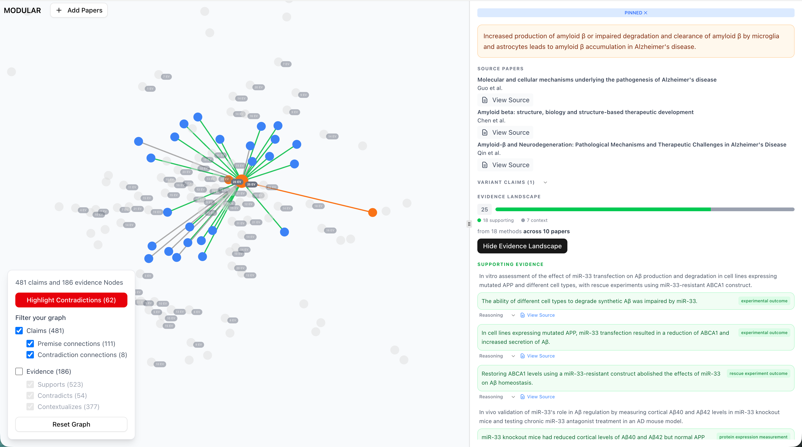

# Modular 



An app for researchers to upload papers and receive a cross-linked map of claims, methods, and observations from those papers.

## What it does

- stores uploaded paper PDFs
- parses PDFs using Grobid service
- extracts from parsed PDF (LLM)
    - core claims per paper
    - methods used in a paper if applicable
    - observations resulting out of each method
- saves coordinates of extract sources so we can find them in the PDF
- links extracts of papers in the same library (LLM)
    - claim2claim: duplicate, contradiction, variant, premise
    - claim2method: if the method could produce observations relevant to the claim
    - observation2claim: support, context, contradict
- some library level summaries

We're using jobs on the DB and parallel workers to make this more efficient.

## Why it does this

Scientific communication is hamstrung by an outdated medium: papers. Communicating knowledge in more granular iterations would significantly speed up progress. A more granular medium also allows more efficient LLM-based reasoning and opens up new design space for metrics of scientific merit, ultimately enabling us to move beyond citations and journal prestige as proxies of quality of work. [Learn more](https://oshimascience.com/)
Modular lets researchers process their existing research libraries into graphs of claims and evidence to begin shifting the understanding of and narrative around what scientific output could be.

## Structure

```
modular/
├── app/          # Vite React frontend (runs on http://localhost:5173)
├── api/          # FastAPI backend (runs on http://localhost:8000)
└── package.json  # Root package with dev scripts
```

## Setup

1. Install frontend dependencies:
```bash
cd app && npm install
```

2. Install backend dependencies (requires [uv](https://docs.astral.sh/uv/)):
```bash
cd api && uv sync
```

3. Set up environment variables:
```bash
cp app/.env.example app/.env
cp api/.env.example api/.env
# Then edit both .env files with your keys
```

4. Run GROBID (PDF parser):
```bash
docker run --rm -p 8070:8070 lfoppiano/grobid:0.8.1
```
See [GROBID documentation](https://grobid.readthedocs.io/) for more options.

## Running

**Option 1: Docker (Recommended for Quick Setup)**
```bash
cd api && docker-compose up
```
See [API README](api/README.md#docker-setup-optional) for Docker prerequisites and details.

**Option 2: Local Development**

**Frontend** (Terminal 1):
```bash
cd app && npm run dev
```

**Backend** (Terminal 2):
```bash
cd api && ./start-dev.sh
```

This starts the API server and worker processes together with prefixed logs. Workers are required to process jobs (PDF parsing, extraction, linking).

Alternatively, run API and workers separately for cleaner debugging:
```bash
# Terminal 2: API only
cd api && uv run uvicorn main:app --reload --port 8000

# Terminal 3: Workers
cd api && uv run python worker.py --workers 4
```

## Accessing

- Frontend: http://localhost:5173
- Backend: http://localhost:8000
- API Docs: http://localhost:8000/docs

## Tech Stack

**Frontend**
- React 18 + TypeScript - Type-safe UI components
- Vite - Fast development and build tooling
- TanStack Query - Server state management with automatic caching
- react-force-graph-2d - Interactive knowledge graph visualization
- Tailwind CSS - Utility-first styling

**Backend**
- FastAPI - Modern Python web framework with auto-generated OpenAPI docs
- DSPy - LLM orchestration for extraction and linking pipelines
- Pydantic - Runtime type validation and serialization
- uv - Fast Python package management
- Grobid - Academic PDF parsing service

**Infrastructure**
- Supabase - Managed PostgreSQL + S3-compatible file storage
- Docker - Containerized deployment for API and dependencies
- Postgres job queue - Async task processing with multiprocessing workers

**Architecture Notes**

The backend uses a job queue pattern to handle long-running LLM calls:
- Papers are uploaded and stored in Supabase
- Jobs are created in Postgres for parsing, extraction, and linking
- Multiple worker processes claim and execute jobs in parallel
- Each job type (parse, extract, link) runs independently and updates the database

This architecture allows the API to respond immediately while heavy processing happens asynchronously. The extraction pipeline uses DSPy to orchestrate Claude API calls, pulling structured claims/methods/observations from parsed PDFs, then cross-linking them across the entire library.

API documentation is auto-generated from FastAPI route definitions at `/docs` using OpenAPI/Swagger.
